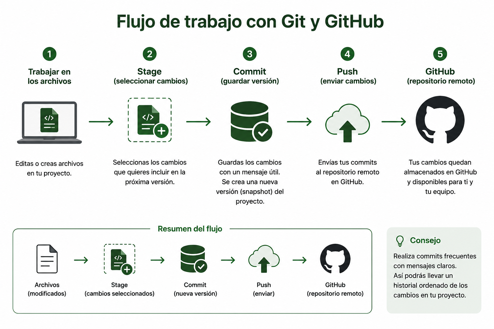
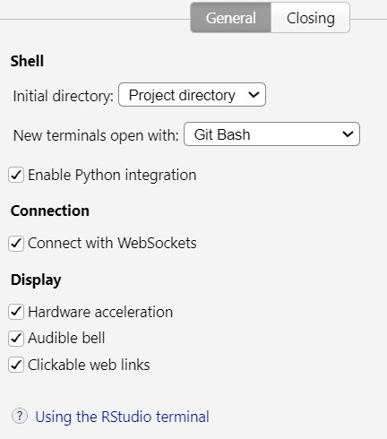

::: institucion
Escuela de Ciencias Biológicas

Universidad Nacional

Ecología de Poblaciones y Comunidades

Profesor: Héctor Zumbado Ulate
:::

## Práctica 1

### Objetivo

Al finalizar esta práctica, el estudiante será capaz de:

Configurar Git para trabajar desde RStudio. Crear un repositorio en GitHub. Conectar un proyecto de RStudio con GitHub. Realizar el primer commit y push.

## Instrucciones

**Git** es un sistema de control de versiones instalado en la computadora. **GitHub** es una plataforma remota donde se alojan y comparten repositorios. Cada vez que ocurre un cambio y este es declarado (Commit), GitHub registra una nueva versión del proyecto (snapshot).

### Proceso:

1- Trabajar en los archivos del proyecto

2- Seleccionar cambios a declarar (Stage)

3- Declarar (Commit) y agregar un mensaje útil (Commit message)

4- Realizar envíos al repositorio de GitHub desde RStudio (Push)

5- Recibir información en RStudio desde GitHub (Pull)

En esta práctica los cambios se originarán tanto en GitHub como en RStudio para comprender cómo ambos ambientes permanecen sincronizados mediante Git.

## Pasos

1.  Compruebe que tiene una cuenta activa en GitHub

2.  Descargue e instale Git (<https://git-scm.com/install/windows>)

3.  Abra RStudio, y configure global tools para trabajar Git y la versión de R más reciente. Siga las siguientes instrucciones:

4.  Configure la terminal (tools/global_options/terminal)

    

5.  Genere una clave SSH (Tools/Global Options/Git SVN) y agréguela a GitHub (opcional pero altamente recomendado). Se recomienda utilizar autenticación mediante claves SSH, ya que evita introducir credenciales cada vez que se envían cambios al repositorio.

6.  Crear repositorio en GitHub con el nombre eco_pc_2026. Siga las indicaciones del profesor.

7.  Crear nuevo proyecto en RStudio con el nombre eco_pc_2026. Marque las casillas git y renv. Siga las indicaciones del profesor.

8.  Abra una terminal nueva y ejecute las siguientes líneas una por una:

    **Verificaciones**

    `git --version: Comprueba que Git está instalado.`

    `git config --global --list: información agregada en GitHub`

    **Configuración inicial**

    `git config --global init.defaultBranch main #indica que el directorio o rama principal se llama main`

    `git config --global core.autocrlf true # permite realizar trabajos colaborativos entre computadoras con diferentes sistemas operativos`

    **Identidad**

    `git config --global user.email "email"` #añadir email privado en GitHub#añadir usuario de GitHub

    si añadió una clave SSH ejecute la siguiente línea

    `SSH -T git@github.com #`Confirma conexión a traves de clave SSH

    Ejecute las línes que aparecen en GitHub

    `git remote add <SSH-url>`: conecta remotamente RStudio con el repositorio de GitHub

    `git remote -v`: Verifica la conexión remota con GitHub

    `git push -u origin main`: Envía el proyecto por primera vez al repositorio remoto.

9.  Desde la interfaz web de GitHub, cree un archivo README.md con una breve descripción del proyecto.

10. Regrese a RStudio y utilice Pull para descargar el nuevo archivo al proyecto local.

### **Lista de verificación**

□ Git instalado

□ GitHub creado

□ Proyecto creado

□ Git conectado

□ Primer Commit realizado

□ Primer Push exitoso
